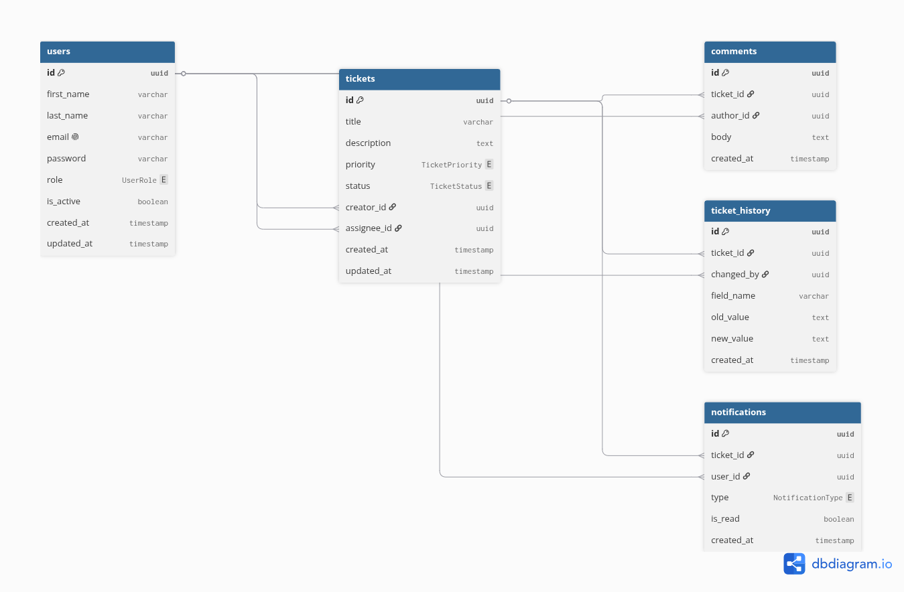

# Ticket Management App

A full-stack ticket/case management web application built for a senior engineering take-home assessment.

## Stack

| Layer | Technology |
|---|---|
| Frontend | SvelteKit + TypeScript + Tailwind CSS v4 |
| Backend | Django 5 + Django REST Framework |
| Database | PostgreSQL 16 |
| Cache | Redis 7 |
| Task broker | RabbitMQ 3.13 |
| Background tasks | Celery 5 + Celery Beat |
| Monitoring | Sentry |
| CI/CD | GitHub Actions |
| Containers | Docker + Docker Compose |

---

## Git Branching Strategy

To keep the development organized and align with the assessment guidelines, the repository uses the following branch structure:

- **`main`**: Production-ready release branch.
- **`dev`**: Integration branch for development features.
- **`feature/*`**: Topic branches for implementing new requirements (e.g., `feature/dashboard`, `feature/tickets`).
- **`fix/*`**: Bugfix branches for resolving issues (e.g., `fix/cors-headers`, `fix/celery-imports`).

---

## Entity Relationship Diagram (ERD)

The database schema design is structured as follows:




## Quick Start (Docker — recommended)

### Prerequisites
- Docker Desktop or Docker Engine + Compose plugin
- Git

### 1. Clone the repository

```bash
git clone <repo-url>
cd Simple_Ticket_Management_App
```

### 2. Configure environment variables

```bash
cp backend/.env.example backend/.env
cp frontend/.env.example frontend/.env
# Edit backend/.env — at minimum set a strong SECRET_KEY
```

### 3. Start all services

```bash
make up
```

### 4. Run migrations

```bash
make migrate
```

### 5. Load sample data (fixtures)

```bash
make seed
```

### 6. Create an admin user

```bash
make createsuperuser
```

### Access the app

| Service | URL |
|---|---|
| Frontend | http://localhost:5173 |
| Backend API | http://localhost:8000/api/ |
| Swagger UI | http://localhost:8000/api/docs/ |
| Django Admin | http://localhost:8000/admin/ |
| RabbitMQ UI | http://localhost:15672 |

---

## Local Development (without Docker)

### Backend

```bash
cd backend
python -m venv .venv
source .venv/bin/activate
pip install -r requirements.txt
cp .env.example .env   # then edit .env
python manage.py migrate
python manage.py runserver
```

In a separate terminal, start the Celery worker:

```bash
cd backend
source .venv/bin/activate
celery -A core worker --loglevel=info
```

### Frontend

```bash
cd frontend
npm install
cp .env.example .env
npm run dev
```

---

## Running Tests

```bash
# Backend (with coverage)
make test-backend

# Frontend
make test-frontend
```

---

## Linting

```bash
make lint-backend    # ruff check + ruff format --check
make lint-frontend   # prettier + eslint
```

---

## Project Structure

```
.
├── backend/                  # Django project
│   ├── core/                 # Project config (settings, urls, celery, asgi, wsgi)
│   ├── apps/                 # Feature apps (created incrementally)
│   ├── fixtures/             # Sample data (JSON fixtures)
│   ├── tests/                # Top-level test suite
│   ├── logs/                 # Rotating log files (gitignored)
│   ├── media/                # User-uploaded files (gitignored)
│   ├── staticfiles/          # Collected static files (gitignored)
│   ├── Dockerfile
│   ├── requirements.txt
│   ├── pytest.ini
│   └── ruff.toml
│
├── frontend/                 # SvelteKit application
│   ├── src/
│   │   ├── lib/
│   │   │   ├── api/          # HTTP client layer
│   │   │   ├── components/   # Reusable UI components
│   │   │   ├── stores/       # Svelte stores (global state)
│   │   │   ├── types/        # TypeScript interfaces
│   │   │   ├── utils/        # Pure helper functions
│   │   │   └── constants/    # App-wide constants
│   │   └── routes/
│   │       ├── (app)/        # Authenticated pages (dashboard, tickets, profile)
│   │       └── (auth)/       # Public pages (login, register)
│   ├── static/
│   └── Dockerfile
│
├── .github/workflows/ci.yml  # GitHub Actions CI
├── docker-compose.yml
├── Makefile
├── .editorconfig
└── README.md
```

---

## Makefile Commands

Run `make help` to see all available commands.

---

## Assumptions & Notes

- JWT is used for API authentication.
- Google OAuth is planned via `django-allauth` (not yet implemented).
- The Celery email backend defaults to `console` in development (no SMTP needed).
- `SENTRY_DSN` left empty disables Sentry; set it to activate monitoring.
